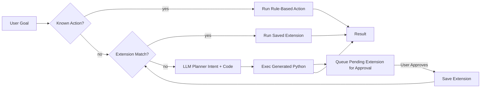

# Jarvis Hybrid AutoExtend

> **Local, privacy‑respecting AI agent for Windows** that can take goals, perform actions, learn new skills from AI‑generated code, and help you reason about your projects — even completely offline (with a local model via Ollama).

---

## ✨ Highlights

- **Hybrid Action Engine** – Fast built‑ins (open apps/sites, create notes, system info) + **AI fallback** that plans and generates Python code for new goals.
- **Self‑Extending** – When the AI generates working code for a new task, the snippet is **queued as a pending extension**. Approve it once → it becomes a **reusable skill**.
- **Learning Mode** – Point Jarvis at a project folder; it scans structure, summarizes with an LLM, and stores a searchable memory.
- **Chat Mode** – Use your local model like a mini GPT inside the same console.
- **Configurable Privacy** – Explicit allow‑lists for folders; toggle system actions & browser opens.
- **Full Logging** – Everything recorded to `logs/jarvis.log` (toggle echo in console).

---

## 📷 Screenshots

> Place the screenshots below in `docs/` before pushing to GitHub. Rename as shown.

| Screenshot | Description                                                        |
| ---------- | ------------------------------------------------------------------ |
|            | The main Python modules that power Jarvis Hybrid AutoExtend.       |
|            | Output from Learning Mode: project scan + AI architecture summary. |

If you have the provided architecture image, include it too:


---

## 🧱 Project Structure

```
jarvis_hybrid/
├── __init__.py
├── actions.py              # Fast rule‑based actions (open apps, web, create note, system info...)
├── agent.py                # Hybrid goal runner (actions → extensions → AI plan → extension queue)
├── chat.py                 # Multi‑turn chat interface with local LLM
├── code_exec.py            # Safe(ish) subprocess Python execution sandbox
├── config.py               # Load/save runtime config (model, allow_roots, permissions)
├── console.py              # Terminal UI & menus
├── extension_manager.py    # Save, approve & run learned action extensions
├── logger.py               # Batched async logger → logs/jarvis.log
├── memory.py               # SQLite memory (goals, project summaries)
├── ollama_client.py        # HTTP + CLI fallback interface to Ollama
├── planner.py              # Ask LLM for structured JSON plan (intent + python_code)
├── scan.py                 # Fast project scan for Learning Mode
└── voice.py                # (stub) hook for speech input
```

---

## 🧩 How the Hybrid Loop Works



---

## 🚀 Quick Start

> Tested on **Windows 10/11**, Python **3.11+**.

```powershell
# 1. Extract the repo somewhere (example path)
cd C:\Projects\Jarvis_Hybrid_AutoExtend

# 2. Create & activate a virtual environment
python -m venv .venv
. .venv\Scripts\activate

# 3. Install dependencies
pip install -r requirements.txt

# 4. (Optional) Install Ollama + a local model (faster = mistral)
# ollama pull mistral

# 5. Run Jarvis
python -m jarvis_hybrid.console
```

---

## 🛡 Privacy & Permissions

Jarvis **never scans your whole system automatically**. You control access.

From the console:

- **Settings → Add Root** to allow a folder (e.g., `C:\Users\YourName\Projects`).
- Toggle whether Jarvis can **launch system apps** or **open the web**.
- Edit `config.json` directly if preferred.

**Warning:** If you enable system actions and approve AI‑generated scripts, those scripts can run commands. Always review code in the Extension Manager before approving.

---

## 🧠 Learning Mode (Project Scan + Summary)

1. Main Menu → **4. Learning Mode**.
2. Enter a folder path *inside an allowed root*.
3. Jarvis scans directory structure (ignores heavy folders like `node_modules`).
4. Sends summary of structure to LLM → **architecture summary**.
5. Stores in memory (searchable later).

**Example output:** (from screenshot)

```
The project structure contains the following components:
1. actions.py … defines functions that the agent can perform.
2. agent.py … core AI goal logic.
3. chat.py … user ↔ AI convo interface.
...
```

---

## 💬 Chat Mode (Like GPT, Fully Local)

From main menu choose **8. Chat with Assistant**.

- Multi‑turn memory for the session (last \~12 turns).
- Uses the model set in `config.json`.
- Type `exit` to return.

---

## 🛠 Goals & Actions

From main menu choose **1 → Add Goal**. Try:

- `open youtube`
- `open notepad`
- `create note`
- `battery status`
- `read file C:\Some\Allowed\Folder\example.txt`
- `make a csv with 5 rows of test data` *(will trigger AI plan; see auto‑extend)*

Run your goals: **3. Run Goals**.

Outputs print in console *and* log to `logs/jarvis.log`.

---

## 🤖 Auto‑Extending Skills (Learned Actions)

When Jarvis receives a goal it doesn't understand:

1. Planner asks the LLM for JSON (intent + python\_code).
2. Generated Python runs in a sandbox.
3. The code is **queued as a pending extension**.
4. You approve, name it, and assign trigger keywords.
5. Next time Jarvis sees a goal containing that trigger → it runs the saved extension instantly.

### Manage Learned Actions

Main Menu → **9. Manage Learned Actions**.

- **List Approved Extensions** – shows reusable skills.
- **List Pending Extensions** – AI‑generated code waiting for you.
- **Approve Pending** – review code; assign triggers; save.
- **Delete Pending** – discard unwanted or unsafe code.

Approved scripts live in: `extensions/`.

---

## 🧪 Example Extension Approval Flow

1. Add goal: `make a csv with 5 rows of test data`.
2. Run goals – AI generates Python that writes a CSV.
3. Go to **Manage Learned Actions** → check *Pending*.
4. Approve → triggers: `make csv,test csv`.
5. Now type `make csv` → runs saved extension (no LLM wait).

---

## 🔧 Configuration File

`config.json` (created on first run):

```json
{
  "model": "mistral",
  "allowed_roots": ["C:/Users/YourName/Projects"],
  "console_echo": true,
  "allow_system_actions": true,
  "allow_web_open": true
}
```

> **Tip:** Commit `config.example.json` to Git instead of your real `config.json`.

---

## 📦 Packaging for GitHub

Recommended repo layout:

```
Jarvis_Hybrid_AutoExtend/
├── jarvis_hybrid/
├── extensions/                # (generated; ignored unless sharing)
├── logs/                      # (runtime; gitignored)
├── config.example.json        # safe template
├── requirements.txt
├── README.md                  # this file
└── .gitignore
```

### .gitignore Template

```gitignore
__pycache__/
*.pyc
.venv/
venv/
env/
logs/
memory.db
config.json
extensions/pending_extensions.json
*.log
.DS_Store
Thumbs.db
```

---

## 🔄 Updating the Repo

```powershell
git add -u
git add docs/*.png  # if adding screenshots
git commit -m "Update README + screenshots"
git push
```

---

## 🛣 Roadmap (Ideas)

- ✅ Self‑extending learned actions
- ⏳ Parameterized extensions (auto parse numbers, file names from goal text)
- ⏳ Voice goals w/ offline Whisper
- ⏳ GUI tray & notification bubbles
- ⏳ Background auto‑automation suggestions (detect repeat behavior)
- ⏳ Real embeddings (FAISS + sentence transformers) for semantic memory

Open an issue or PR with ideas!

---

## 🤝 Contributing

Pull requests welcome. Please:

1. Open an issue first for major features.
2. Keep modules small & testable.
3. Include Windows instructions for new dependencies.

---

## 📄 License

**MIT** (or edit to your preferred license).

---

### ❤️ Thanks

Built with the goal of helping you think, build, and automate locally — while controlling your privacy.

If you publish your repo, drop the link — I’d love to check it out!

